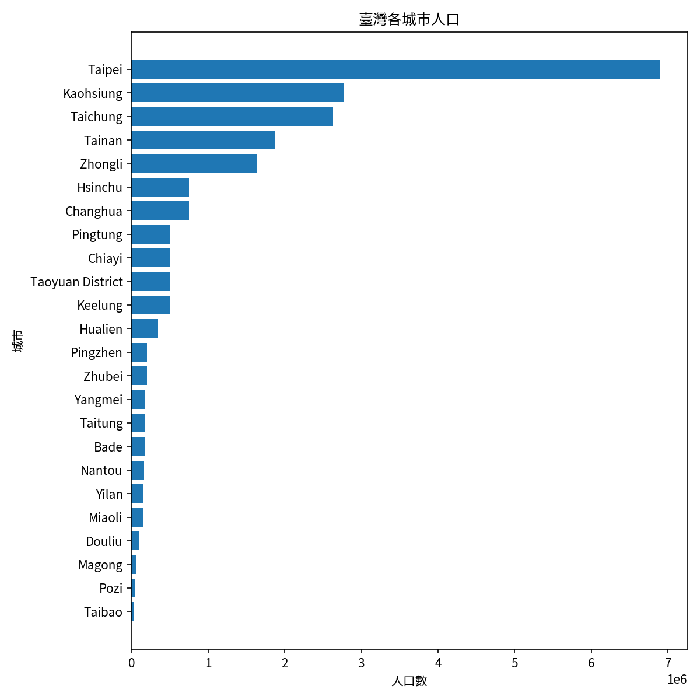

# HW1 | 環境建置與第一次 Agent 協作

| **項目** | **內容** |
| --- | --- |
| 學號 / 姓名 | S1254059 / 吳佳泰 |
| 週次 | 第一週 |
| 使用工具 | Claude Code CLI |
| 模型與權限模式 | auto |
| 成果連結 | [Google Colab](https://drive.google.com/file/d/1uQqeGe7BP_UgzhpqDf8k_fNR3EIiS57o/view?usp=sharing)、[GitHub](https://github.com/taitaiwu/python/blob/main/GIS_Programming/notebooks/01_first_look.ipynb) |
| 花費時間 | 約  1 小時 |

---

# 1. Before AI

**本週引導題的回答：**

1.  **還沒打開資料前，你猜這份全球城市資料裡，臺北、臺中、彰化的人口各是多少？你的數字從哪裡來？**
    > **Ans：** 臺北市 255 萬、台中市 300 萬、彰化 124 萬，這些數字是之前的印象
    
2.  **Colab 重新連線後，哪些東西會消失（套件、檔案、變數）？為什麼資料要放在雲端硬碟？**
    > **Ans：** 沒有放在雲端資料夾的緩存檔案會消失，因此資料要放在雲端硬碟才會被保存
    

---

# 2. Ping-Pong Log

| 輪次 | 我的提問 | AI 回應重點 | 我的觀察 |
|:---:|:---|:---|:---|
| 1 | 產生 notebooks/01_first_look.ipynb，讀取 data/raw/worldcities.csv，內容包括：欄位與型態、缺值統計、人口前 20 大城市、臺灣所有城市的清單，以及人口長條圖（中文標題與標籤） | 已建立 notebooks/01_first_look.ipynb，共 18 個儲存格 | 發現結果有些缺值 (NaN) |
| 2 | 為什麼那麼多缺值 | 缺值多為 capital ，此欄位只有 4 種值，包含 primary、admin、minor 和 null，而大部分的城市都為都被歸類在 null ， 因此缺值，其他缺值則是真的缺乏資料 | 發現台灣某些地區的人口有缺值 |
| 3 | 那為什麼沒有板橋、南港和金城的人口，這些不是應該很好取得嗎 | 這些資料本來就很好取得，缺值不是因為「取得困難」，而是這份資料集本身的缺口。 |  |

---

# 3. 決策表

| 編號 | AI 的建議 | 採納／拒絕／修改 | 我的理由 | 我怎麼驗證（具體動作） |
|:---:|:---|:---:|:---|:---|
| 1 | AI 一開始把 population 缺值（板橋、南港、金城）歸因於「行政中心層級城市資料較難取得」 | 拒絕 | 板橋（新北市）、金城（金門縣）、南竿（連江縣）都是知名縣市治所，人口數字並不難查，跟「取得困難」的說法矛盾 | 追問「這些不是應該很好取得嗎」，逼 AI 重新叫出這三筆的完整欄位（admin_name），才發現它們其實代表整個新北市／連江縣／金門縣，不是小鎮 |
| 2 | AI 解釋 capital 欄位缺值（10,247 筆）是「有意義的空值」，不是資料缺陷 | 採納 | AI 有先實際列出 capital 欄位的 4 種取值（primary/admin/minor/空白）與各自筆數佐證，邏輯站得住腳，且符合常識（大多數城市本來就不是行政中心） | 追問「為什麼那麼多缺值」，檢查 AI 給的欄位值分布數字是否合理（212/3907/1127/10247，加總等於總筆數） |
| 3 | AI 提議把「新北/連江/金門 是系統性資料缺口，非取得困難」的更正判讀補進 notebook | 修改 | 想先留存這次判讀過程的完整脈絡，再決定要不要精簡寫進 notebook | 要求「把我們這則對話紀錄匯出」並指定 Markdown 格式，作為之後回頭核對判讀依據的紀錄 |

---

# 4. 最終產出與個人結論

* 最終產出
    
    
* 個人結論
    > 臺北市人口最多
    

---

# 5. 附件

* [對話紀錄：01_first_look.ipynb 建立與資料判讀](../conversation/01_first_look_對話紀錄.md)