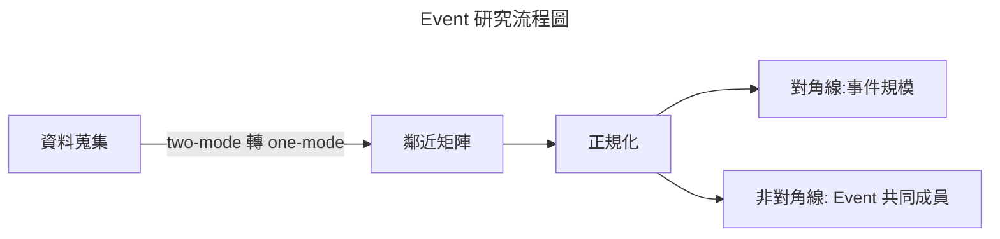

# 社會網路分析與地理應用 期末專題研究報告

* 標題：**連結地理系的橋樑**:探討團體活動參與對地理系學生人際網路影響與傳承結構
* 成員：地理四 S1143022 蔡家晨 / 地理四 S1143042 吳侑謙 / 地理三 S1243038 張庭瑜 / 資工三 S1254059 吳佳泰

---

# Event 事件分析

## 輸出結果
* 鄰近矩陣
    |  | 系學會 | 地理營 | 探索營 | 迎新 | 系環 | 系羽 | 男排 | 女排 |
    | --- | --- | --- | --- | --- | --- | --- | --- | --- |
    | **系學會** | 93 | 41 | 15 | 65 | 16 | 38 | 9 | 10 |
    | **地理營** | 41 | 48 | 15 | 41 | 13 | 23 | 5 | 7 |
    | **探索營** | 15 | 15 | 18 | 17 | 7 | 10 | 3 | 3 |
    | **迎新** | 65 | 41 | 17 | 83 | 20 | 40 | 11 | 11 |
    | **系環** | 16 | 13 | 7 | 20 | 21 | 12 | 6 | 2 |
    | **系羽** | 38 | 23 | 10 | 40 | 12 | 52 | 5 | 2 |
    | **男排** | 9 | 5 | 3 | 11 | 6 | 5 | 12 | 0 |
    | **女排** | 10 | 7 | 3 | 11 | 2 | 2 | 0 | 11 |

* Jaccard 正規化 
    |  | 系學會 | 地理營 | 探索營 | 迎新 | 系環 | 系羽 | 男排 | 女排 |
    | --- | --- | --- | --- | --- | --- | --- | --- | --- |
    | **系學會** | 1.0 | 0.41 | 0.16 | 0.59 | 0.16 | 0.36 | 0.09 | 0.11 |
    | **地理營** | 0.41 | 1.0 | 0.29 | 0.46 | 0.23 | 0.30 | 0.09 | 0.13 |
    | **探索營** | 0.16 | 0.29 | 1.0 | 0.20 | 0.22 | 0.17 | 0.11 | 0.12 |
    | **迎新** | 0.59 | 0.46 | 0.20 | 1.0 | 0.24 | 0.42 | 0.13 | 0.13 |
    | **系環** | 0.16 | 0.23 | 0.22 | 0.24 | 1.0 | 0.20 | 0.22 | 0.07 |
    | **系羽** | 0.36 | 0.30 | 0.17 | 0.42 | 0.20 | 1.0 | 0.08 | 0.03 |
    | **男排** | 0.09 | 0.09 | 0.11 | 0.13 | 0.22 | 0.08 | 1.0 | 0.00 |
    | **女排** | 0.11 | 0.13 | 0.12 | 0.13 | 0.07 | 0.03 | 0.00 | 1.0 |

    > $J(A, B) = |A ∩ B| / |A ∪ B|$

## 分析結果
* 對角線分析：依據鄰近矩陣的結果，我們可以發現 event 規模由小到大排序為系學會、迎新、系羽、地理營、系環、探索營、男排、女排。
* 非對角線分析：將鄰近矩陣進行 jaccard 正規化，得出 event 間共同成員的比例

---

# Actor 角色分析
* 鄰近矩陣 ： 見程式碼輸出

